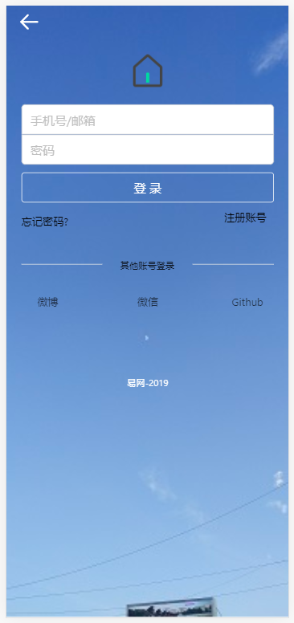
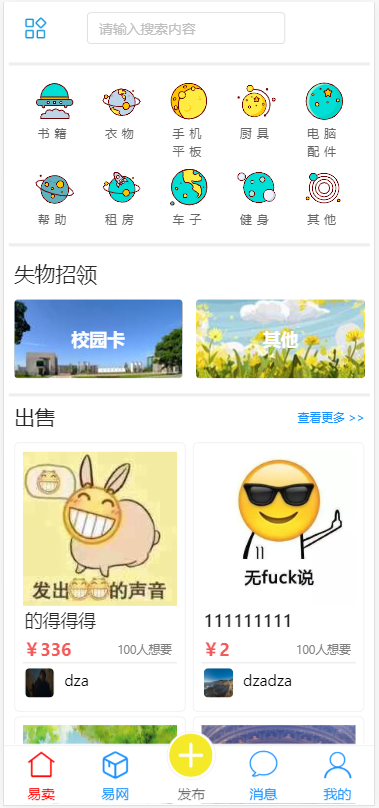
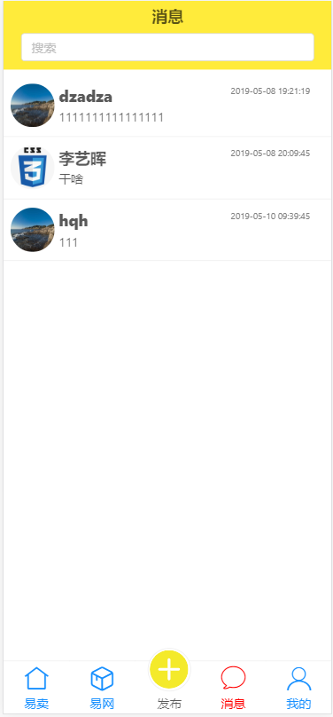
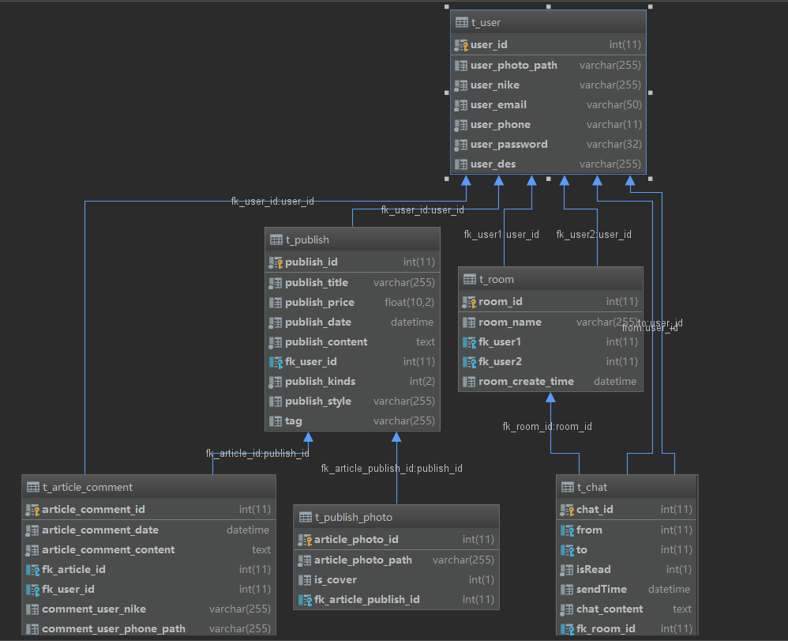
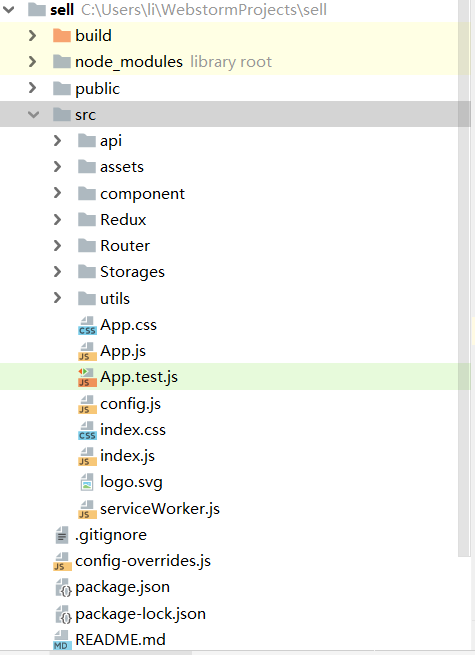
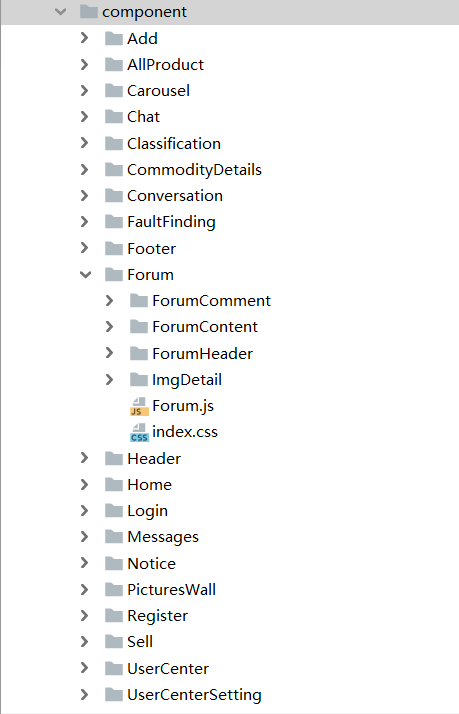
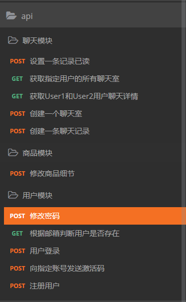

<h1 style="text-align:center">易网二手交易平台项目</h1>

#### 一.项目背景
`在大学校园里，由于大学生消费的不理智行为，因此学生会有很多闲置的东西。而通常的二手交易都进行在QQ群里面，但是在QQ群里面的消息发布是很低效并且不容易被关注的。因此我决定开发一个平台来更好的解决这个问题，平台并不提供具体的金钱交易服务，只是提供一个发布商品以及交易沟通的平台。项目为前后端分离的项目，前端使用React搭建，后端使用springboot+flask+node.js开发。该项目目前只有web手机端，后续可能会使用flutter重构项目一个APP版本`

#### 二.主要功能与特点
1.主要功能

`1.登录注册`

`2.发布商品，修改商品，删除商品`

`3.聊天功能`

`4.发布阅读帖子，评论收藏`

`5.大图查看`

2.项目技术

`1.后端使用jwt验证技术，使用token进行权限验证`

`2.使用redis作为mysql数据库缓存，减轻数据库压力`

`3.使用redux作为项目的全局state管理，减少性能和稳定性的隐患`

`4.使用PureRenderMixin对组件进行性能优化，减少不必要的组件重渲染，优化用户体验`

`5.使用axios作为前后端异步通信，消除阻塞`

`6.UI主要使用antd与阿里巴巴矢量图标库`

`7.使用webSocket作为聊天功能的技术支持，实现客户端与服务端的双向数据传输，实现高性能的实时刷新`

#### 三.软件架构

`前端：React.js+Redux+axios+antd+socket.io+moment.js+antd`

`后端：springboot+Mybatis+JWT+python+express`

`版本控制：git+githubDesktop`

#### 四.工具清单

##### 1.开发工具
`webStrom + vscode + IDEA  + Tomcat`

##### 2.版本控制工具
`git + githubDesktop` 

##### 3.项目管理工具
`Maven`
##### 4.数据持久化
`Mysql + redis + localStorage`

#### 五.作品图片展示

##### 1.登录界面

    

##### 2.首页界面

    

##### 3.聊天消息界面

    

#### 六.数据库表设计

    

#### 七.前端设计

##### 1.目录结构

    

##### 2.组件

    

#### 八.后端部分API接口

    

#### 九.项目地址与下载运行
##### 1.项目下载
项目地址：<https://github.com/liyihui6/JXAU-Second-Hand-Trading-Platform-FE>
##### 2.项目运行

`1.部署好后端服务器，因为考虑到功能模块化开发，因此后端服务分为有主要的内容服务器，图片服务器和聊天服务器`

`2.下载后解压进入文件目录后，输入npm i安装依赖`

`3.输入npm run start运行项目`
